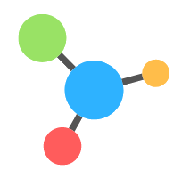

# Neutron <small>0.0.1</small>

> A programming language based on C and Python.

- Super Modern & Easy to Learn Syntax
- Extremely Extensible

[GitHub](https://github.com/the-neutron-foundation/neutron-language)
[Get Started](README)
